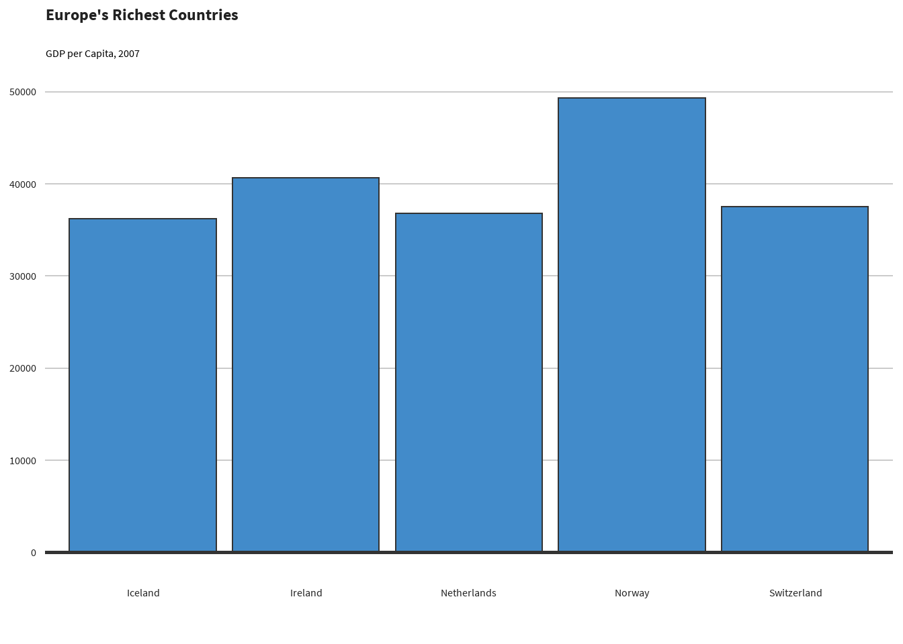
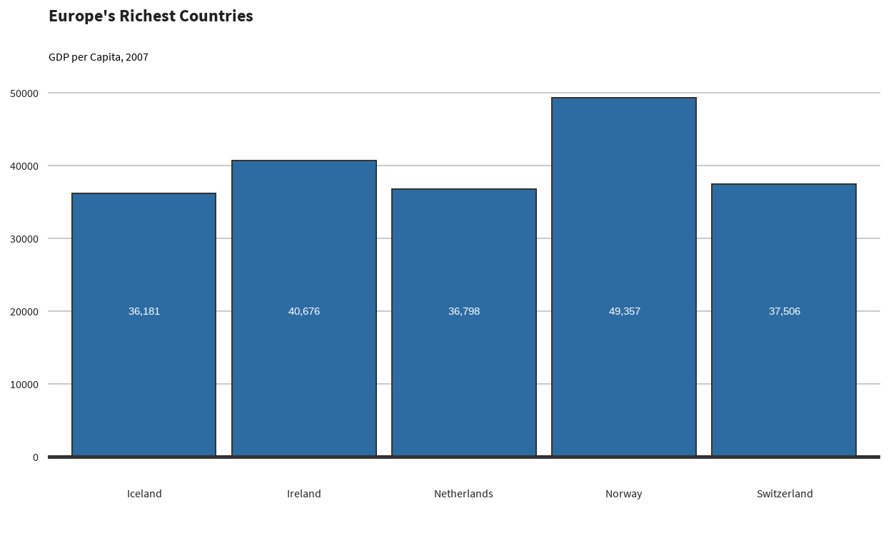

<!-- README.md is generated from README.Rmd. Please edit that file -->

# sccthemes

<!-- badges: start -->

[](https://lifecycle.r-lib.org/articles/stages.html#experimental)
<!-- badges: end -->

The goal of sccthemes is to provide a consistent styling framework and
helper functions for graphics made in ggplot at the Suffolk County
Council.

This package has been heavily inspired by
[bbplot](https://github.com/bbc/bbplot), the BBC’s R package for
creating and exporting graphics made in ggplot.

## Installation

You can install the development version of sccthemes from
[GitHub](https://github.com/) with:

``` r
# install.packages("devtools")
devtools::install_github("thomaszwagerman/sccthemes")
```

## Suffolk County Council

The font and colour codes have been sourced from the [Suffolk County
Council’s website](https://www.suffolk.gov.uk/), and Google Chrome’s
Inspect functionality (Ctrl + Shift + i).

The style can be called to any ggplot2 object using `scc_style()`

``` r
library(ggplot2)
library(gapminder)
library(dplyr)
library(sccthemes)

barchart_data <- gapminder |> 
  filter(year == 2007 & continent == "Europe") |> 
  arrange(desc(gdpPercap)) |> 
  head(5)

barchart_data |> 
  ggplot(aes(x = country, y = gdpPercap)) +
  geom_bar(
    stat = "identity",
    position = "identity",
    color = "#333333",
    fill = "#428bca"
  ) +
  geom_hline(
    yintercept =  0,
    size = 1,
    colour = "#333333"
  ) +
  scc_style() +
  labs(
    title = "Europe's Richest Countries",
    subtitle = "GDP per Capita, 2007"
  )
```



## Helper functions for ggplot2

Helper functions for certain types of plots are also provided in this
repo.

Instead of the code above for instance, this package also contains
helper functions which are rough and ready:

``` r
library(ggplot2)
library(gapminder)
library(dplyr)
library(sccthemes)

barchart_data <- gapminder |> 
  filter(year == 2007 & continent == "Europe") |> 
  arrange(desc(gdpPercap)) |> 
  head(5)

scc_barchart(
  barchart_data,
  x = "country",
  y = "gdpPercap",
  title = "Europe's Richest Countries",
  subtitle = "GDP per Capita, 2007"
)
```


Currently, there are helper functions for the following plot types:

- Barplots
- Piecharts (but why you [should discourage their use if you
  can](https://www.data-to-viz.com/caveat/pie.html))

The BBC’s [“ggplot
cookbook”](https://bbc.github.io/rcookbook/#make_a_bar_chart) is a good
starting point to use as a reference.

More helper functions will be added as I need to make them.

## Future additions to this package

If there is a further need in the future, other styling options can be
added.

For example:

- [bslib](https://rstudio.github.io/bslib/) themes for Shiny, see this
  example from [UKCEH](https://github.com/NERC-CEH/UKCEH_shiny_theming).
- gt table themes
