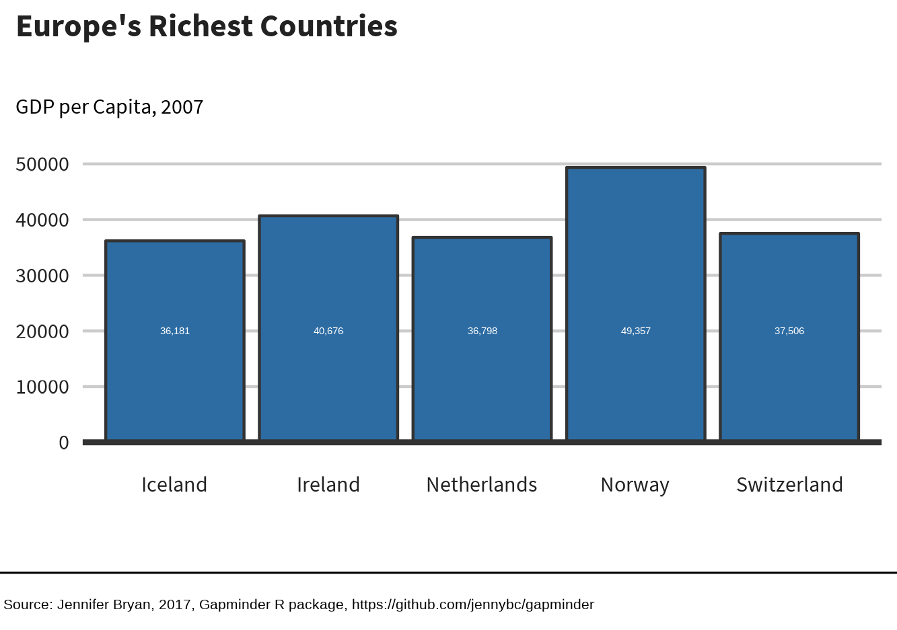

## Make a barchart

```{r helper_example, warning = FALSE, message = FALSE}
library(ggplot2)
library(gapminder)
library(dplyr)
library(sccthemes)

barchart_data <- gapminder |> 
  filter(year == 2007 & continent == "Europe") |> 
  arrange(desc(gdpPercap)) |> 
  head(5)

scc_barchart(
  barchart_data,
  x = "country",
  y = "gdpPercap",
  title = "Europe's Richest Countries",
  subtitle = "GDP per Capita, 2007"
)

```


## Make a piechart
Example on how to make a pie chart, but [why you shouldn't](https://www.data-to-viz.com/caveat/pie.html)
```{r piechart, warning = FALSE, message = FALSE}
library(sccthemes)
library(gapminder)
library(dplyr)

asia_pop <- gapminder |> 
  filter(year == 1997 & continent == "Asia") |> 
  select(country, lifeExp, pop, gdpPercap) |> 
  top_n(5)

asia_pop$country <- forcats::fct_drop(asia_pop$country)

scc_piechart(
  asia_pop,
  asia_pop$gdpPercap,
  asia_pop$country,
  title = "GDP per Capita contribution percentage by county",
  subtitle = "Five largest countries only"
  )
```

## Publishing your plots

To publish your work, so will need to save your plot. Saving plots in ggplot2 can be a bit of a hassle, so we're porting bbplot's `finalise_plot()` function. Some adjustments have been made, for example we might not want a logo on every plot. Also, because this package does not just deal with ggplot, I've renamed the function `finalise_ggplot()`, to specify this is for `ggplot2` object only.

Once you have created your plot and are happy with it, you can use `finalise_ggplot()` so that you can look at it outside RStudio. Note that the position of the text and other elements do not render accurately in the RStudio Plots panel, so saving it out and opening up the files give you an accurate representation of how the graphic looks.

Also you might want to use the same plot for different purpose: the size of a plot in a presentation will need to be a different size from one in a report. `finalise_ggplot()` allows for this without having to change the original plot.

```{r finalise_ggplot, warning = FALSE, message = FALSE, fig.show = "hide"}
library(ggplot2)
library(gapminder)
library(dplyr)
library(sccthemes)

barchart_data <- gapminder |> 
  filter(year == 2007 & continent == "Europe") |> 
  arrange(desc(gdpPercap)) |> 
  head(5)

plot_to_save <- scc_barchart(
  barchart_data,
  x = "country",
  y = "gdpPercap",
  title = "Europe's Richest Countries",
  subtitle = "GDP per Capita, 2007"
)

finalise_ggplot(
  plot_to_save,
  source = "Jennifer Bryan, 2017, Gapminder R package, https://github.com/jennybc/gapminder",
  save_filepath = "inst/plots/publish_plot_example.png",
  width_pixels = 225,
  height_pixels = 165
)

```
<p align="center"></p>
